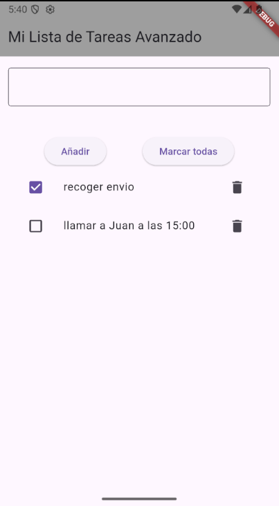
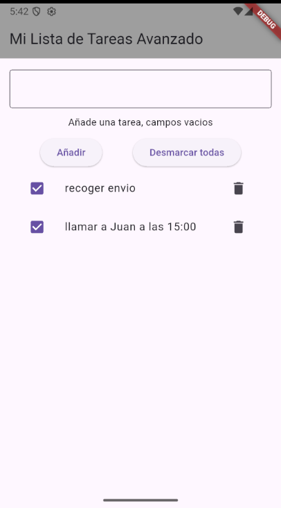
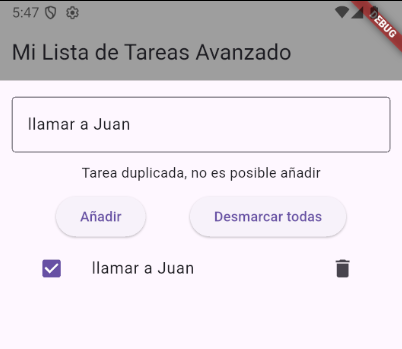

# lista_tareas_avanzada

## Objetivo

Aprender a manejar listas de objetos, checkboxes, validaciones y botones dinámicos en Flutter.

## Funcionalidades

- Añadir tareas con validación de duplicados y campos vacíos
- Checkbox independiente por tarea
- Borrar tarea individual
- Botón "Marcar/Desmarcar todas" con texto dinámico y lógica

## Conceptos aprendidos

- setState y control de estado
- Variables locales en build
- ListView.builder con objetos personalizados
- Validaciones y mensajes dinámicos
- Lógica de botones dinámica según estado

## Capturas

Pantalla principal con tareas añadidas:  

Todas las tareas marcadas, botón "Desmarcar todas":  

Ejemplo de mensaje de error por duplicado:  

